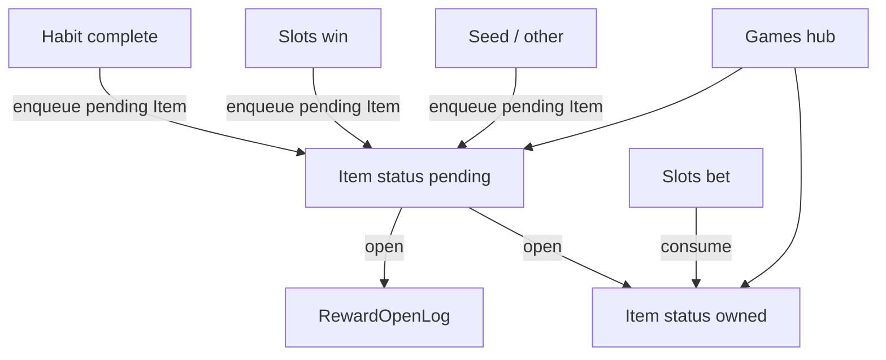

# Gamba: Unified Items + Slots PoC

## Context

On branch `gamba`. The habits app already has `HabitReward` (`kind: POINTS`, JSON payload) tied 1:1 to a habit, but there is no inventory, spend path, or player progress store. Auth does not exist; README targets local/mobile-first SQLite.

**Domain stance:** This is a game progression system, not a gambling ledger. No wallet, no bank-style ledger. **A reward is an item**—one table, two life-cycle states. The open-log is the audit trail.

**Defaults locked for this plan:**

- First PoC game: **3-reel slots**
- Rendering: **React + CSS** (no Phaser yet)
- Currency: classic **gold** (`key: "gold"`)
- Persistence: **SQLite + MikroORM**
- **Reward = Item:** no separate Reward vs Item tables; pending items *are* the reward queue

## Domain model



### Core concepts

| Concept | Role |
|---------|------|
| **Item** | Single entity for both rewards and inventory. `status: pending` = unopened reward in queue; `status: owned` = in inventory. PoC key: `gold`. |
| **Inventory** | Query view: owned items (sum `quantity` where `key = "gold"` and `status = owned`). Not its own table. |
| **Reward queue** | Query view: pending items. Not its own table. |
| **RewardOpenLog** | Immutable record of an open and its **result** (quantities, optional game meta). Replaces a ledger. |
| **Habit grant template** | Today's `HabitReward` stays template-only: "on complete, enqueue pending Item(s)". Habits never own live items. |

### Why this shape

- One mental model: everything you can hold or claim is an **Item**.
- Opening flips pending → owned (and logs the result)—no second “grant payload” entity.
- Slots, habits, and future systems all `enqueue` the same row type.
- Extensible later with more `key` values (tokens, boosters) without new tables.

### Types (sketch)

```ts
type ItemKey = "gold"; // extend later

type ItemSource =
  | "habit_complete"
  | "game_win"
  | "game_consolation"
  | "seed"
  | "system";

type ItemStatus = "pending" | "owned";

/** One table: pending = reward queue, owned = inventory */
type Item = {
  id: number;
  key: ItemKey;
  quantity: number;
  status: ItemStatus;
  source: ItemSource;
  sourceRef?: string; // habitId, gameRoundId, etc.
  createdAt: Date;
  openedAt?: Date;
};

type RewardOpenLog = {
  id: number;
  itemId: number;
  openedAt: Date;
  result: {
    key: ItemKey;
    quantity: number;
    meta?: unknown; // e.g. slots reels, multiplier
  };
};
```

**Open behavior for stackable gold:** open a pending gold item → set it `owned` (or merge quantity into a single owned gold row and mark/remove the pending row). Prefer **merge into one owned gold stack** so inventory stays one row per key; the open log keeps per-open history.

### HabitReward migration

Keep [`HabitReward`](lib/db/entities/HabitReward.ts) as the habit-side **template** only.

- Existing `kind: POINTS` + `{ points: N }` → enqueue `Item { key: "gold", quantity: N, status: "pending", source: "habit_complete" }`.
- Live instances live only on `Item`.

### Service (`lib/items/`)

One module—no split inventory/reward services:

| API | Behavior |
|-----|----------|
| `enqueue({ key, quantity, source, sourceRef? })` | Insert `status: pending` |
| `listPending()` | Items where `status = pending` |
| `getOwnedQuantity(key)` | Sum owned stacks for key |
| `open(itemId)` | Pending → owned (merge gold), set `openedAt`, write `RewardOpenLog` |
| `consume(key, qty)` | Decrease owned quantity; fail if insufficient |

Slots / habits call this module only—never mutate rows from the UI.

**Invariants:**

- Owned quantity changes only via `open` (add) and `consume` (remove).
- Every open writes exactly one `RewardOpenLog`.
- Bets **consume** owned gold; wins **enqueue** pending gold then **auto-open** (still through `open()` so the log is complete).
- Insufficient gold → bet rejected.

## Design: Core Loop

```
HABIT COMPLETE → enqueue pending gold item → open → owned gold
→ enter hub → consume gold to spin → win enqueues pending gold → open → owned gold
```

- **30-second slots loop:** choose stake → consume gold → spin → feedback → win item opened into inventory → repeat
- Soft RTP (~90–95%) so gold drains slowly; habits refill via the same enqueue/open path

## Architecture

### Route layout

| Route | Role |
|-------|------|
| `/` | Habits home |
| `/games` | Hub: owned gold, pending items, game list |
| `/games/slots` | Slots PoC |

Nav: link from habits into `/games`; hub back-link to habits.

### Game plugin contract (`lib/games/`)

```ts
type GameMeta = {
  id: string;
  title: string;
  description: string;
  href: string;
  minBet: number; // in gold
  enabled: boolean;
};
```

Registry: `lib/games/registry.ts` — adding a game = registry entry + route + consume/enqueue calls.

### Slots PoC mechanics

- 3 reels, fixed paytable, bets 1 / 5 / 10 gold
- Server Action `playSlots(stake)`:
  1. `consume("gold", stake)`
  2. Roll outcome
  3. If payout > 0: `enqueue({ key: "gold", quantity: payout, source: "game_win", sourceRef: roundId })` then `open(...)` (auto)
  4. Return `{ reels, payout, gold, openLogEntry }`
- Client animates to server outcome; pause when tab hidden

## Implementation phases

### Phase 1 — Domain foundation

1. MikroORM entities: **`Item`**, **`RewardOpenLog`** only (no Reward table, no Inventory table, no Item catalog table—`ItemKey` enum is enough for PoC)
2. Register in [`lib/db/config.ts`](lib/db/config.ts)
3. Implement [`lib/items/itemService.ts`](lib/items/itemService.ts) via [`createClient()`](lib/db/Database.ts)
4. Server Actions: `getGold`, `listPendingItems`, `openItem`, `seedStarterItem` (enqueue small pending gold so PoC is playable)

### Phase 2 — Games hub

1. [`app/games/page.tsx`](app/games/page.tsx) — owned gold, pending item list, registry cards
2. Open affordance on hub (tap pending item → open → show result from open log)
3. Visual direction: loot/inventory feel—deep green / brass accents, display font for hub only

### Phase 3 — Slots PoC

1. [`app/games/slots/page.tsx`](app/games/slots/page.tsx) + reel client UI
2. Paytable + RNG in `lib/games/slots/`
3. Wire `playSlots` through consume + enqueue/open
4. Win/loss feedback from returned open result

### Phase 4 — Habit enqueue + glue

1. On complete in [`HabitCard`](app/components/HabitCard.tsx): template → `enqueue` pending gold (leave pending for hub, or auto-open—same API)
2. Nav habits ↔ games; empty gold CTA; pending-item CTA
3. Short `GAMES.md`: Item life cycle, how to add a game, how to grant from new sources

## Out of scope for this iteration

- Real-money gambling
- Auth / multi-user
- Phaser / 3D
- Extra games beyond slots
- Full habit UI off mocks (only enqueue-on-complete needs to work)
- Item keys beyond `gold` (enum ready, not filled)

## Success criteria

- Completing a habit enqueues a **pending Item**; opening it makes gold **owned** and writes an open log
- `/games` shows owned gold + pending items (same `Item` table, different status)
- Slots consumes owned gold; wins enqueue+open items into the same table
- Open log covers habit and slots opens alike
- No separate Reward table exists; a second game only needs registry + consume/enqueue
